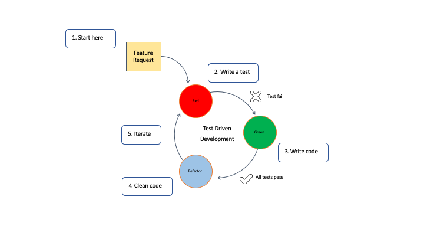
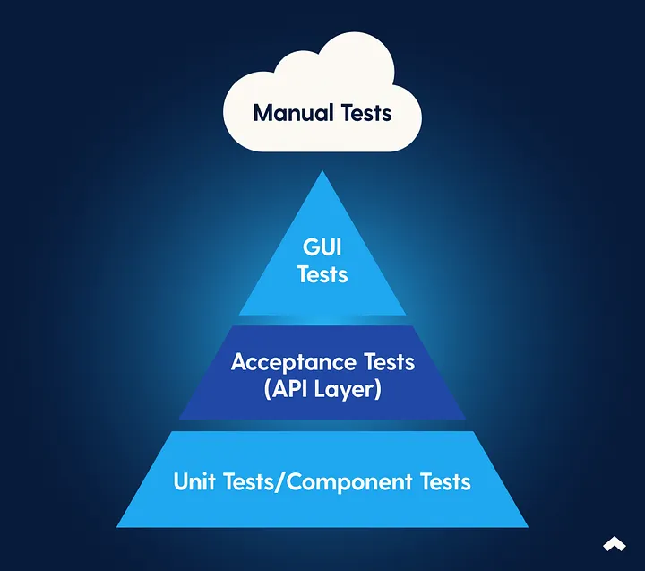

# TDD - Aplicaciones fiables y robustas

## Metodología



Definición de una feature:
- Casos de uso
- Criterios de aceptación

Desarrollo iterativo:

- Identificación de funcionalidades
- Definición de casos de uso y criterios de aceptación
- Codificación de tests y aserciones
- Implementación de la funcionalidad en ciclo iterativo
  - Falsa implementación -> Mocks / Stub
  - Implementación Obvia -> Atacar primero las funcionalidades más sencillas
  - Iteración -> Hasta completar la funcionalidad
- Mocking vs stubbing
  - Mock -> Simular un objeto servicio
  - Stubbing -> Simular un comportamiento (ejecutar otra lógica en lugar de la real)

## Capa de testing



- Test unitarios: bajo nivel, prueba lógica
- Test de aceptación: capa interfaz (API, SDK)
- Test de integración: diferentes capas y componentes (GUI/Sistemas e2e)
- Test manuales: validación por usuario / qa

### Cuando aplicar?

- Lógica y sentido común
- Test unitarios:
  - Paquetes con lógica de dominio/negocio (arq. hexagonal, capas dominio y aplicación independientes)
  - Funcionalidad complejas difícil de integrar con servicios
  - Casos borde difícilmente reproducibles
- Test de aceptación:
  - API's SDK's que van a ser integradas por otros servicio y que interactuan con infraestructura (API's, Streams)
- Test de integración:
  - Ecosistema variado
  - Sistemas críticos
  - Alta volatilidad
- Test manuales:
  - Baja volatilidad
  - Sistemas no críticos de baja complejidad
  - Sistemas críticos y complejos con gestión y circuitos de cambio normalizados

## BDD + Gherkin

Behavior Driven Development -> TDD enfocado a comportamiento

- Se centra en cómo debe comportarse el sistema, independientemente de cómo está construido
- Involucra a stakeholders, desarrolladores y testers
- Promueve especificaciones legibles por humanos que sirven:
  - Como documentación
  - Como código para testing
- Relaciona features con historias de usuario y criterios de aceptación

Gherkin

- Lenguaje formal para escribir especificaciones en bdd
- Feature: describe una funcionalidad
- Scenario: describe un caso de uso
- Steps:
  - Given: contexto o precondiciones
  - When: acción que dispara el comportamiento
  - Then: criterios de aceptación, resultado esperado
  - And / But: para encadenar steps

Ventajas:

- El equipo funcional puede definir en un mismo lenguaje:
  - Casos de uso y criterios de aceptación
  - Batería de tests usables por desarrolladores para testar

Ejemplos:

```
Feature: As a manager I wan't to view one of my customer's file
  Scenario: A manager can view their customer's file
    Given the authenticated manager user John
    And the customer Peter managed by John
    When I access to Peter customer's file
    Then I get the Peter customer's file
```


## Tecnologías y herramientas

### Test unitarios

| Lenguaje / Plataforma | Suite de Testing | Mocking / Stubbing | Gestión de Containers / Integración de dependencias |
|-----------------------|------------------|--------------------|-----------------------------------------------------|
|Java| JUnit 5          |Mockito|Testcontainers, Docker Compose + Maven/Gradle |
|Python | pytest, unittest |unittest.mock, pytest-mock, mock|pytest-docker, testcontainers-python|

### Test de aceptación (BDD + Gherkin)

Permiten decorar funciones/métodos para asociarlos a steps Gherkin

| Lenguaje / Plataforma | Suite      | 
|-----------------------|------------|
|Java| Cucumber   |
|Python | pytest-bdd |

# Resumen

TDD + BDD nos permite:
- Construir iterativamente software robusto y fiable
- Implicar a stakeholders y testers desde el primer momento
- Mejorar la comunicación entre equipo técnico y funcional
- Definir criterios de aceptación claros, basados en la realidad que implementan
- Minimizar riesgos en resolución de deuda técnica